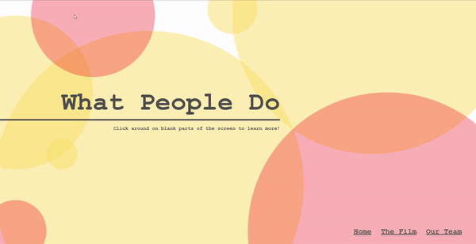
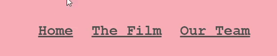
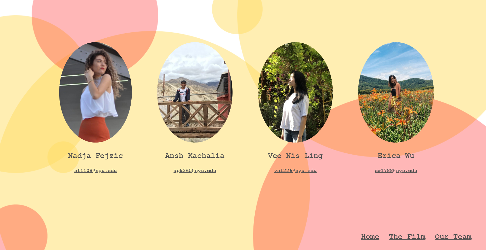

# [What People Do](https://vnling.github.io/30MFF)

For this assignment, our task was to create a website to display and "tell the story" of a film we created in thirty minutes. 

## Concept and Theme

The film created by my group, titled What People Do, is a reflection on our everyday activities in quarantine. We wanted to use this creative opportunity to reflect on the beauty that remains in life and the human experience. We chose to underlay the film with an upbeat soundtrack to echo the optimism seen in our footage, and to convey our hopes for the future. Consequently, I wanted to create a site that would reinforce the message of our film. I settled on a bright and bubbly (literally) concept, aiming to create a site that prioritizes intuitive navigation and interactivity. 

## Process: Overview

I began by wireframing the website I wanted to create. This wireframe initially had four pages: the homepage, a page where users can watch the film, a page detailing our team's inspirations, and a page about our team. This helped me focus on the design of the website, allowed me to create more intentional interactions, and gave me a useful starting point.

I followed this by creating HTML and CSS files, which formed the visual elements of the page. With these, I was able to display nearly all the content I wanted to. The only things remaining (which I coded in Javascript) were the interactive elements. 

## Process: Interactions

I initially planned to create a photo carousel of relevant images, but then realized that I would have to take those images from the video itself, which didn't make much sense. Instead, I decided to "animate" the background of my page to add some whimsy to the website. The bubbles are initially static, but begin moving once the user clicks on the canvas. The user can also trigger a change in the bubbles' directions by clicking on the canvas again. 

Additionally, I had planned to have a page half occupied by text about the film; however, I realized that having too much text on the screen might be boring for users. With this in mind, I decided to instead have the text in a sort of "carousel" on the front page, with "rotations" triggered by clicks on the canvas as well.

I also used CSS to make the links in the menubar turn white when they are hovered over:

## Other Results

Below are screenshots of the other pages on my website. The backgrounds on these pages are interactive in the same way the homepage is, though these interactions are not the focus of the page.

## Reflections

I feel like I largely met my goals in terms of fulfilling my design vision: all the visual elements look like I intended for them to, and the changes that I made to the interactions were all intentional and (I think) improved the website. In retrospect, I feel that a "one-page" model may have suited this website better, since there ended up not being very much information to convey. However, I am happy with the menubar system of navigation for now, and I think segmenting the website into three pages also made the information on each page clearer. Had the film been shot in person, I would have liked to include more information (e.g. behind-the-scenes photos); due to the limitations we faced, I chose instead to keep the information on each page minimal and let the film speak for itself. I think this website delivers the experience that I intended it to, and I'm very happy with how it turned out!

